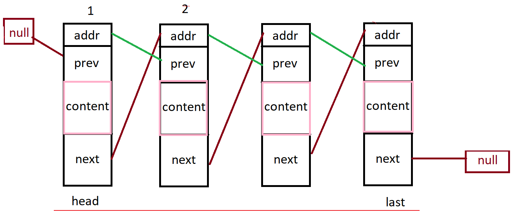

*This project has been created as part of the 42 curriculum by andry-ha, mamiandr.*

# Description
---
## What is push swap ?
``push_swap`` is a program which calculates and displays on the standard output the smallest program, made of Push swap language operations, that sorts the integers received as arguments.

## Goal
The goal of this project is to make you discover algorithmic complexity in a very
concrete way.

# Detailed explaination and algorythme :
---
## Oerations in push swap : ``swap`` ``rotate`` ``reverse`` ``rotate`` ``push``
Let’s explain some push swap rules, and know how we can move in and between the stacks:

- <font color="orange">**sa :**</font> swap a - swap the first 2 elements at the top of stack a. Do nothing if there is only one or no elements).
- <font color="orange">**sb :**</font> swap b - swap the first 2 elements at the top of stack b. Do nothing if there is only one or no elements).
- <font color="orange">**ss :**</font> sa and sb at the same time.
- <font color="orange">**pa :**</font> push a - take the first element at the top of b and put it at the top of a. Do nothing if b is empty.
- <font color="orange">**pb :**</font> push b - take the first element at the top of a and put it at the top of b. Do nothing if a is empty.
- <font color="orange">**ra :**</font> rotate a - shift up all elements of stack a by 1. The first element becomes the last one.
- <font color="orange">**rb :**</font> rotate b - shift up all elements of stack b by 1. The first element becomes the last one.
- <font color="orange">**rr :**</font> ra and rb at the same time.
- <font color="orange">**rra :**</font> reverse rotate a - shift down all elements of stack a by 1. The last element becomes the first one.
- <font color="orange">**rrb :**</font> reverse rotate b - shift down all elements of stack b by 1. The last element becomes the first one.
- <font color="orange">**rrr :**</font> rra and rrb at the same time.

# Instructions
## What is Big-O notation?
Big-O notation is a method used to determine the complexity of an algorithm. It measures the performance of an algorithm. The most common are O(1) (constant), O(n) (linear), and O(n^2) (quadratic).


### Main Big-O Notations (from fastest to slowest):

- <font color="orange">**O(1) Constant execution time:**</font> The algorithm takes the same amount of time regardless of the size of the data (e.g., accessing the first element of an array).
 ```Python
 # In Python
def first_element(values):
	return values[0]

# Tests
assert first_element([1]) == 1
assert first_element([1, 2]) == 1
assert first_element([1, 2, 3]) == 1
assert first_element([1, 2, 3, 4]) == 1
```

- <font color="orange">**O(log n)Logarithmic execution time:**</font>

	**Are you familiar with binary search?**

	It's a technique used to search sorted lists of data. The middle element of the dataset is selected and compared to a target value. If the values ​​match, the result is positive.
	If the search value is greater than the target value, the upper half of the dataset is processed, and the same operation is performed.

	The algorithm reduces the problem by half at each step (e.g., binary search).
```Python
# In Python
def binary_search(array, item):
	low = 0
	high = len(array) - 1
	while low <= high:
		mid = (low + high) // 2
		guess = array[mid]
		if guess == item:
			return mid
		if guess > item:
			high = mid - 1
		if guess < item:
			low = mid + 1
	return None
assert binary_search([1, 3, 5, 7, 9], 3) == 1
assert binary_search([1, 3, 5, 7, 9], 7) == 3
```

- <font color="orange">**O(n)Linear execution time:**</font> An algorithm is said to have O(n) complexity if, during its execution, it requires traversing each input element. The time increases proportionally to the size of the data.
	* If you have 10 input elements, you will have 10 iterations.
	* With 10 million elements, you will have 10 million iterations: complexity O(n).

- <font color="orange">**O(n log n)Log-linear time:**</font> Typical of efficient sorting methods such as merge sort.
- <font color="orange">**O(n^2)Quadratic execution time:**</font> The time increases with the square of the data size (e.g., nested loops, bubble sort).
- <font color="orange">**O(2^n)Exponential time:**</font> The time doubles with each addition of an element. Very slow.

|   Big O   | Number of operations for 10 input elements | Number of operations for 100 input elements |
| :--- | :--- | :--- |
|    O(1)   |            1             |             1             |
|  O(log n) |            3             |             7             |
|    O(n)   |            10            |            100            |
|    O(n log n)   |            10            |            200            |
|  O(n^2)   |           100            |           10000           |
|  O(2^n)   |           1024            |           1.2676506e+30           |

## ***Notes***
```c
When you want to move an element to the top:

1️⃣ You calculate its position (index)
2️⃣ You compare it to half the size of the stack

If the element is (in the first half):
	→ move forward
Else (in the second half)
	→ move backward

If : index <= (size / 2)
👉 We use ra
Otherwise:
👉 We use rra
```
 # Resources
 ---
 * [The Big-O notation - On medium.com](https://medium.com/@nioperas06/la-notation-big-o-4767d188f875)
 * [The Big-O notation and examples](https://www.youtube.com/watch?v=QaNwlm8AzMA&t=333s) Youtube video
 * [Introduction to Big O Notation - Neso Academy](https://www.youtube.com/watch?v=4nUDZtRX38U&list=PLBlnK6fEyqRhe8C6qXX0d8fq0TnuQS8Wd) Youtube video
